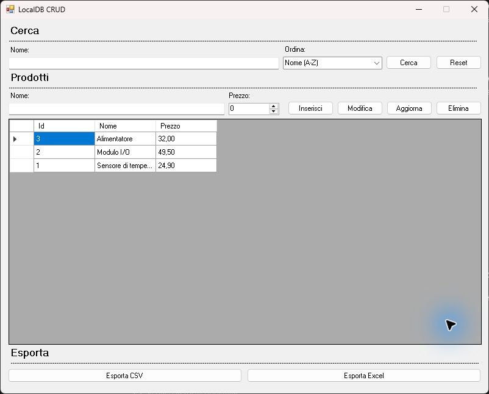

# LocalDBCrud

Applicazione didattica Windows Forms che mostra un flusso CRUD completo su un database locale
SQL Server Express LocalDB. Il progetto è volutamente concentrato sulla gestione dei prodotti:
creazione, lettura, modifica, eliminazione, ricerca, ordinamento ed esportazione CSV/XLSX.



## Funzioni

- avvio diretto della form principale, senza account o autenticazione;
- creazione automatica del database e della tabella `Prodotti` al primo avvio;
- inserimento di tre prodotti fittizi per rendere l'esempio subito esplorabile;
- operazioni CRUD eseguite con query parametrizzate;
- ricerca e ordinamento della griglia;
- esportazione dei dati in CSV e XLSX.

## Requisiti

- Windows 10/11;
- .NET Framework 4.8;
- SQL Server Express LocalDB (`MSSQLLocalDB`);
- Visual Studio 2022 per compilare i sorgenti.

## Primo avvio

Aprire `LocalDBCrud.sln`, ripristinare i pacchetti NuGet e compilare. L'applicazione crea
automaticamente il database `LocalDBCrud`, la tabella `Prodotti` e i dati fittizi, quindi apre
direttamente l'interfaccia CRUD. Non sono previsti utenti, login o credenziali.

## Compilazione

```powershell
nuget restore .\LocalDBCrud.sln
msbuild .\LocalDBCrud.sln /t:Rebuild /p:Configuration=Release
```

## Ambito e limiti

Questo è un esempio didattico, non un modello pronto per dati reali o ambienti di produzione.
Non implementa migrazioni versionate, concorrenza multiutente, audit log o una strategia completa
di backup. L'istanza LocalDB appartiene all'utente Windows corrente.

L'export PDF presente nell'archivio storico è stato rimosso prima della pubblicazione MIT perché
dipendeva da componenti con licenza AGPL/commerciale. Restano CSV e XLSX tramite dipendenze
compatibili, elencate in [THIRD_PARTY_NOTICES.md](THIRD_PARTY_NOTICES.md).

## Licenza

Codice e documentazione originali sono distribuiti con licenza [MIT](LICENSE).
Copyright © 2026 Fabio De Deo — [DDF.Technology](https://www.ddf.technology/).
